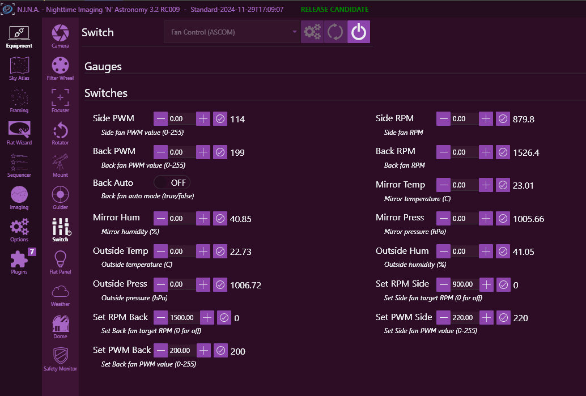
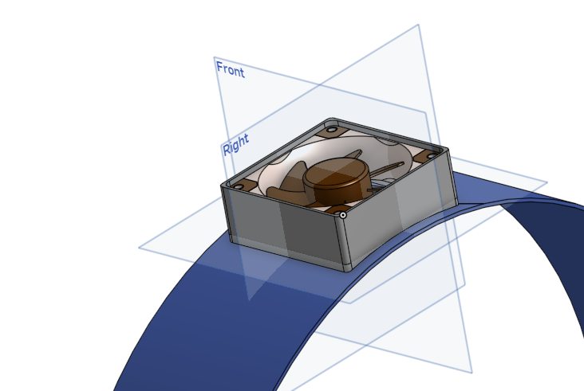

# Telescope Fan Controller (Work in progress!)

**Work in progress**

## Overview

This project provides a hardware and software solution for controlling telescope cooling fans. It supports two fan groups (Rear and Side) and integrates two BME280 temperature/humidity/pressure sensors for environmental monitoring. Automatic fan control is based on temperature differences to optimize mirror cooling.

## Features

- Control two 4-pin PWM fan groups (SIDE and BACK)
- Closed-loop RPM control with PID algorithm
- Serial command interface for tuning and control
- Moving average RPM filtering for stability
- Lookup tables for PWM/RPM/airflow mapping
- Independent duty cycle and RPM tracking per group
- Automatic temperature-based fan control
- ASCOM Switch Driver for Windows integration
- 3D printable fan cases

## Firmware (Arduino)

- PlatformIO-based firmware for microcontrollers
- Supports two BME280 sensors
- Serial interface for configuration
- Automatic and manual fan control modes

### Temperature-based Back Fan Control

- If mirror temp is hotter than outside temp by >3°C, back fans run at 100%
- If mirror temp is hotter by 0.5–3°C, back fans run at speed linearly scaled from 60% to 99%
- If mirror temp is cooler or equal, back fans are off

## ASCOM Switch Driver

- Sensor readings from both BME280 environment sensors
- Switches for PWM or RPM speed control
- Switch for automatic rear fan control

## Getting Started

### Firmware Setup

1. Install [PlatformIO](https://platformio.org/) in VS Code.
2. Open the `Firmware/` folder.
3. Edit `platformio.ini` for your board.
4. Build and upload using PlatformIO.

### ASCOM Driver Setup

1. Open `FanControlAscom/FanControlAscom.sln` in Visual Studio.
2. Build the solution (requires .NET Framework and ASCOM Platform).
3. Register the driver if needed.

## Usage

- Connect the fans and sensors as described in the hardware documentation.
- Use the ASCOM Switch Driver to control fans from astronomy software.
- Use the serial interface for direct firmware control and tuning.

## 3D Printables

[Fan case models (Onshape)](https://cad.onshape.com/documents/0ee577a83dc3cf6bfbe5ad2f/w/54558b9df29646e18a5b41a7/e/03470a87a37047451189f11b)

## Images

## License

This project is licensed under the MIT License.

